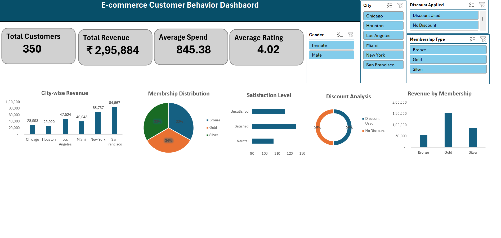

# E-commerce Customer Behavior Dashboard

## Project Overview

This project is an interactive dashboard created in Microsoft Excel to analyze customer behavior in an e-commerce business.

## Dashboard Preview

## Key Metrics

- Total Customers
- Total Revenue
- Average Spend
- Average Rating

## Dashboard Features

- City-wise Revenue Analysis
- Membership Distribution
- Satisfaction Level
- Discount Analysis
- Revenue by Membership
- Interactive Slicers

## Tools Used

- Microsoft Excel
- Pivot Tables
- Pivot Charts
- Slicers
- Dashboard Design

## Skills Demonstrated

- Data Cleaning
- Data Analysis
- Dashboard Design
- Business Insights
- Data Visualization

## Author

**Varsha Bhalavi**
